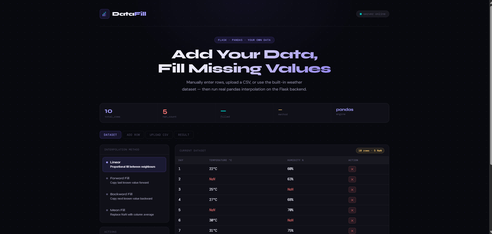
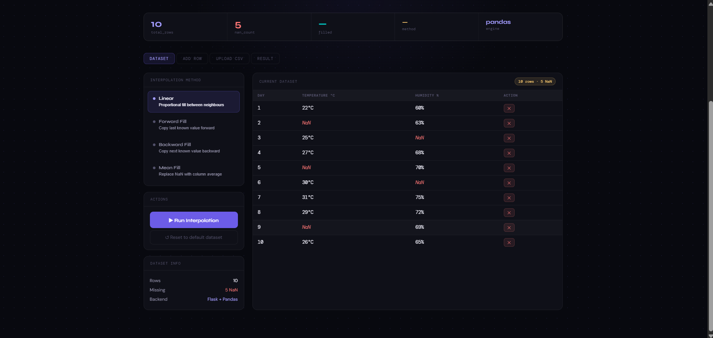
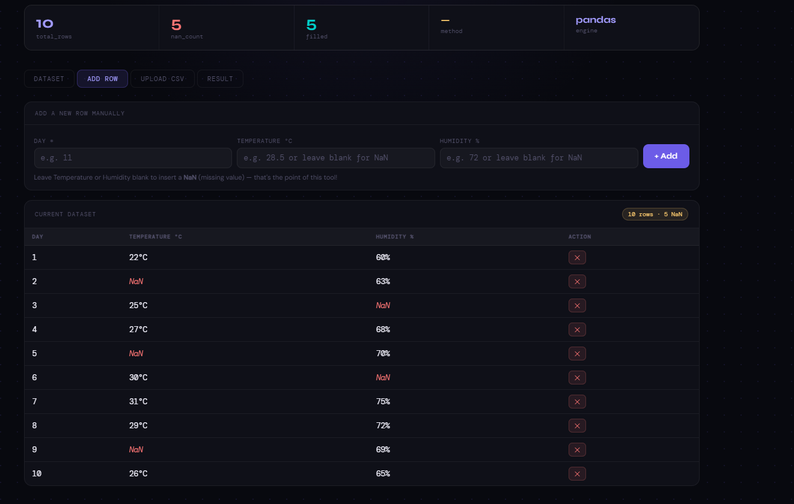
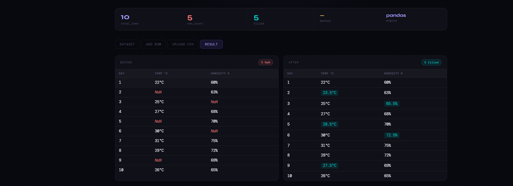
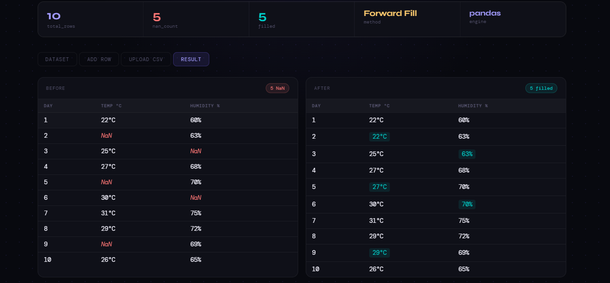
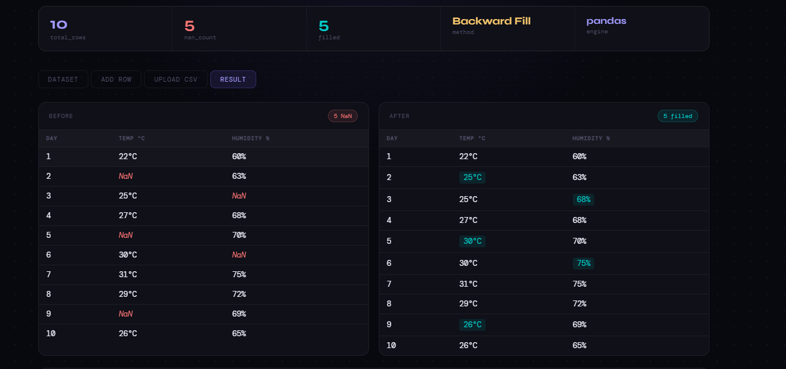
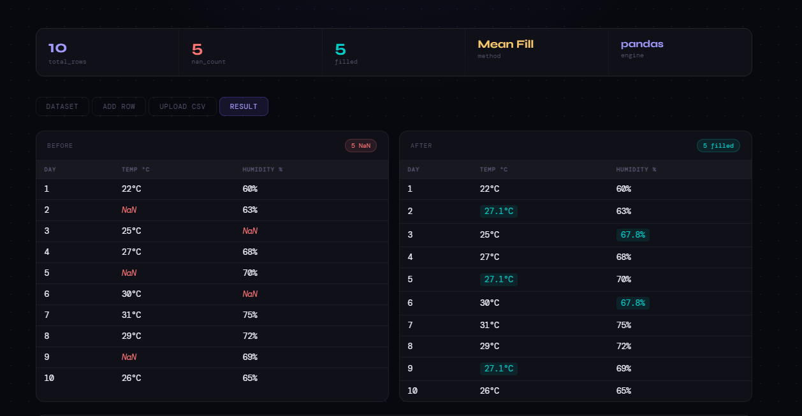
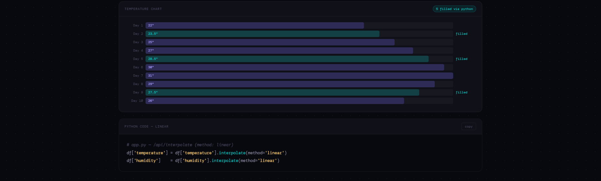

# DataFill — Python Interpolation Tool

> **Flask · Pandas · NumPy · Vanilla JS**
> Add your data, introduce missing values, and fill them with real pandas interpolation — live in the browser.

---

## 📸 Screenshots

### Hero View


### Dataset Tab


### Add Row Tab


### Result — Linear Interpolation


### Result — Forward Fill


### Result — Backward Fill


### Result — Mean Fill


### Temperature Chart


---

## 📋 Overview

DataFill is a full-stack web application that demonstrates real-time missing-value interpolation using Python's **pandas** library on a **Flask** backend. Users can load, inspect, and manipulate a tabular dataset, introduce `NaN` values, select an interpolation strategy, and instantly see the before/after comparison — all without writing a single line of code.

**Key features:**
- 🔌 **Live Flask API** — all interpolation is executed by real pandas on the server
- 🔢 **Four methods** — Linear, Forward Fill, Backward Fill, Mean Fill
- ✏️ **Manual data entry** — add or delete rows directly from the browser
- 📤 **CSV upload** — drag-and-drop any CSV with `day`, `temperature`, `humidity` columns
- 📊 **Visual diff** — before/after tables with highlighted filled cells
- 📈 **Bar chart** — per-day temperature bars, filled values shown in teal
- 💻 **Python code viewer** — copy-ready pandas snippet for the selected method

---

## 📁 Project Structure

```
datafill/
├── app.py        ← Flask server + pandas API
├── index.html    ← Single-page frontend (vanilla JS)
└── README.md
```

---

## 📦 Requirements

| Package | Version | Purpose |
|---------|---------|---------|
| Python | 3.8+ | Runtime |
| Flask | >=2.0 | Web framework & API server |
| pandas | >=1.3 | Interpolation engine |
| NumPy | >=1.21 | Numerical operations |
| flask-cors | >=3.0 | Cross-origin request handling |

---

## 🚀 Quick Start

**1 — Clone and install**
```bash
git clone https://github.com/yourname/datafill.git
cd datafill
pip install flask flask-cors pandas numpy
```

**2 — Run the server**
```bash
python app.py
```

The terminal will confirm:
```
  DataFill Flask Server
  ─────────────────────────────
  Open: http://localhost:5000
  Press CTRL+C to stop
```

**3 — Open the app**

Navigate to [http://localhost:5000](http://localhost:5000) in any modern browser. The status pill in the top-right corner will show **server online**.

---

## ⚙️ API Reference

| Endpoint | Method | Description |
|----------|--------|-------------|
| `/api/data` | `GET` | Return current dataset rows + NaN count |
| `/api/add-row` | `POST` | Append a row `{day, temperature, humidity}` — nulls accepted |
| `/api/delete-row` | `POST` | Remove a row by `{day}` |
| `/api/reset` | `POST` | Restore built-in 10-row weather dataset |
| `/api/upload` | `POST` | Upload a CSV file (multipart/form-data) |
| `/api/interpolate` | `POST` | Run interpolation `{method: linear\|ffill\|bfill\|mean}` |

---

## 🔬 Interpolation Methods

| Method | Pandas Call | Behaviour |
|--------|-------------|-----------|
| **Linear** | `df.interpolate('linear')` | Proportional fill between surrounding known values |
| **Forward Fill** | `df.ffill()` | Repeats the last known value forward |
| **Backward Fill** | `df.bfill()` | Copies the next known value backward |
| **Mean Fill** | `df.fillna(df.mean())` | Replaces every NaN with the column average |

> 💡 **Tip:** Linear interpolation is generally best for time-series data like temperature.

---

## 📤 CSV Upload Format

Your CSV must contain exactly these three column headers (case-insensitive):

```csv
day,temperature,humidity
1,22.0,60.0
2,,63.0
3,25.0,
4,27.0,68.0
5,,70.0
```

- **`day`** — integer row identifier
- **`temperature`** — float °C — leave blank to create a `NaN`
- **`humidity`** — float % — leave blank to create a `NaN`

---

## 📊 Built-in Dataset

The app ships with a 10-row weather dataset containing **5 strategically placed NaN values** to demonstrate all four interpolation methods out of the box.

```
day | temperature | humidity
  1 |        22.0 |     60.0
  2 |         NaN |     63.0
  3 |        25.0 |      NaN
  4 |        27.0 |     68.0
  5 |         NaN |     70.0
  6 |        30.0 |      NaN
  7 |        31.0 |     75.0
  8 |        29.0 |     72.0
  9 |         NaN |     69.0
 10 |        26.0 |     65.0
```

---

## 🛠 Technology Stack

| Layer | Technology |
|-------|------------|
| Backend | Flask 2+ — lightweight Python web framework |
| Data | pandas + NumPy — interpolation, NaN handling, statistics |
| Frontend | Vanilla JavaScript (no frameworks) + CSS custom properties |
| Fonts | Syne, DM Sans, DM Mono via Google Fonts |
| CORS | flask-cors — allows the frontend to call the API from any origin |

---

## ✏️ Customisation

**Change the default dataset**
Edit the `DEFAULT_DATA` dictionary at the top of `app.py`.

**Add more interpolation methods**
Extend the `elif` chain in the `/api/interpolate` route in `app.py`, then add a matching `method-btn` element in `index.html` and a `codeSnippets` entry in the JavaScript section.

**Support additional CSV columns**
Modify `df_to_records()` in `app.py` to serialise extra columns, then update `renderDatasetTable()` in `index.html` to render the new columns.

---

## ⚖️ Licence

MIT — free for personal and commercial use. Attribution appreciated but not required.

---

<p align="center">Built with Flask + pandas</p>
